# 開発環境とファイルの編集方法
# 開発環境の使い方

## 1. GitHubにログインする
右上にアイコンが出ていたらログインできています。  
うちのチームのGoogleアカウントでログインしているなら、Chrome君がアカウントを覚えているはずです。　　

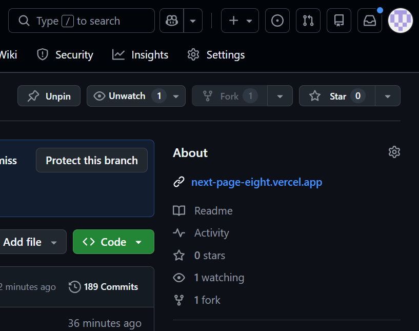  

## 2. GitHub codespacesにアクセスする

https://github.com/nextfp/nextPageにアクセスする。  

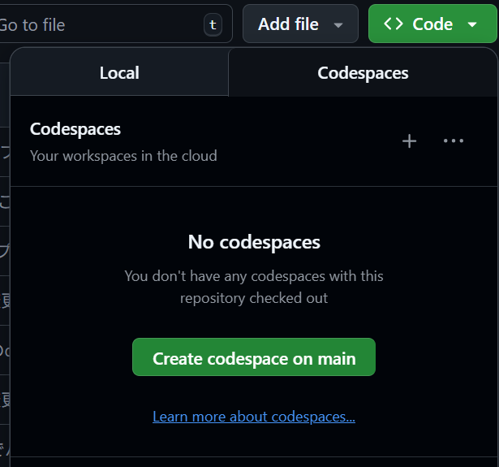  

緑色のcodeボタンを押すと、`codespaces`という項目が出てくるので、そこをクリックする。  
codespacesのところで、`create codespaces on main`をクリックするか。

## 3. vscodeが開く
結構時間がかかるので、ターミナルが開く気長に待ちましょう。  

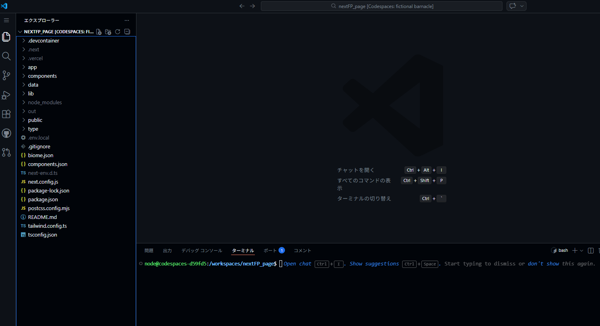  

## 4. コードを編集する
スポンサーの変更方法などはこのページの下部の方に書いてあります。  

## 5. プレビューを表示する
以下の部分のターミナルで以下のコマンドを打ちます。  
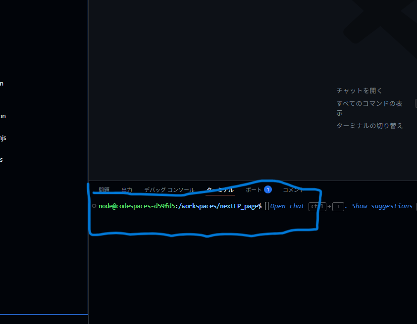  

```
npm run dev
```

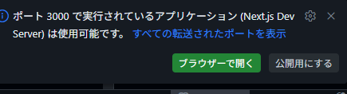  

## 6. 本番環境に反映させる
### 6.1 vercelにログインする
コードを編集した後、以下のコマンドをターミナルで打ちます。  

```bash
npm run deploy
```

若干写真のコマンドが違いますが、`npm run deploy`を打てば大丈夫です。  

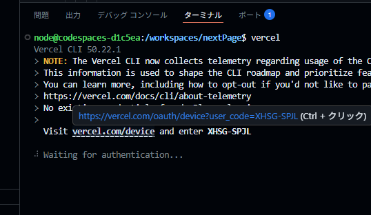   
表示されるurlをctrlを押しながらクリックして、ブラウザで開きます。  

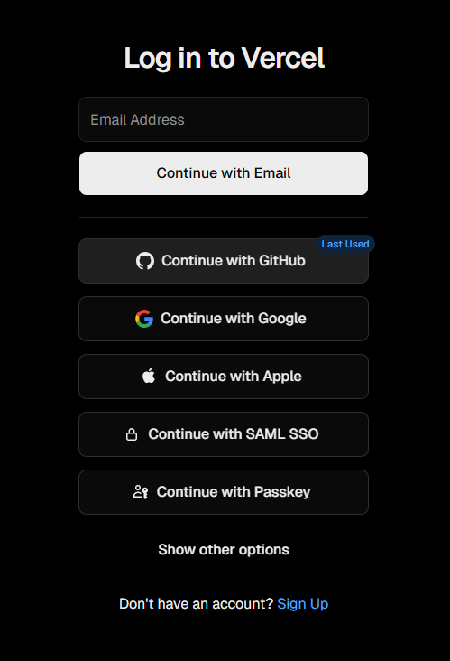  

githubのアカウントでログインします。  
あとは、許可とか続けるとかをクリックしていきましょう。  
ターミナルに戻ります。  

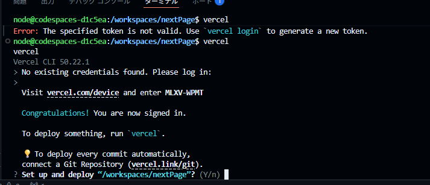  
yを押します。  

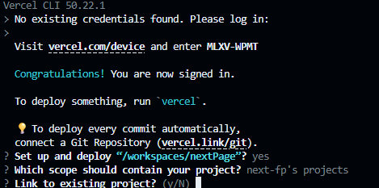  
which scope should contain your project?を`enter`を押す。  
Link to existing project?を`y`を押す。  
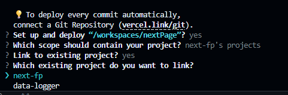  
next-fpを選択して、`enter`を押す。  

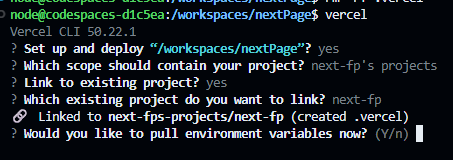  
 Would you like to pull environment variables now?はどっちでもいいです。  
`n`を押してもいいし、`y`を押してもいいです。  

コマンドの実行が完了したら、ブラウザでhttps://next-fp.com/にアクセスして、変更が反映されているか確認してください。  

## 注意点
github codespaceは数か月で消えます。  
必ずファイルを編集した後は、コミットをしましょう。  
コミット方法が分からない場合はAIにコマンドを実行してもらってください。  

# ファイルの編集方法

## ディレクトリ構造

```
app/ ページのコンポーネント
components/ 再利用可能なUIコンポーネント
data/ 静的データ
    |-- chassis.ts シャシーページ用のデータ
    |-- フッターやヘッダーのリンクデータ
    ---
    |-- sponsor.ts スポンサーページ用のデータ
public/ 静的ファイル（画像、フォントなど）
   |-- chassis/ シャシーページの写真
   ...
   |-- sponsor/ スポンサーページに使用している画像
      | -- sponsorList: スポンサーのロゴ画像

```

## 基本的な編集方針
appはUIを大きく変更したいときだけ編集します。ページを大幅に変更する場合はapp内の該当ページを編集してください。  
それ以外の文字列を変更したり、画像を変更したりする場合はdataやpublic内の該当ファイルを編集してください。  
**不用意にapp内のファイルを編集しないように。**  
スポンサー以外のデータを編集する場合は、dataのディレクトリをいじって遊んでみてください。  

## 画像ファイルのロケーション
スポンサーのロゴ画像は`/public/sponsor/sponsorList/`に格納してください。  
画像ファイルの名前は会社名などわかりやすい名前にしてください。  


## スポンサーのデータ編集方法
`/data/SponsorList.ts`にスポンサーの情報がまとめられています。  
以下のような形式でスポンサー情報が記載されています。

```ts
const LiteSponsor: sponsor[] | null = [
  {
    title: "株式会社スズキ",
    Image: "/sponsor/sponsorList/suzuki.svg",
    ImageAlt: "suzuki Logo",
    ImageSize: 0.5,
    bgImage: "/sponsor/engineImage.webp",
    description:
      "エンジン本体やエンジンメンテナンスに使う部品を提供していただいております。",
    popDescription:
      "株式会社スズキは、日本の自動車メーカー。本社は静岡県浜松市中区にある。",
    homePage: "https://www.suzuki.co.jp/",
    twitter: "https://twitter.com/suzukicojpmotor",
  },
  {
    title: "小原歯車工業株式会社",
    Image: "/sponsor/sponsorList/khk.svg",
    ImageAlt: "khk Logo",
    ImageSize: 0.5,
    bgImage: "",
    description: "ラック・ピニオンなどの製品を提供していただいております。",
    popDescription: "",
    homePage: "https://www.khkgears.co.jp/",
    twitter: "",
  },
];
```

これはjson形式に似たTypeScriptのオブジェクト配列です。  
各フィールドの説明は以下の通りです。  

### 1. ロゴ・画像エリア（上部・白背景）

* **Image**: 画像ファイルのパスを指定する項目`/public/sponsor/sponsorList/`の後にファイル名が来るはずです。  
* **ImageAlt**: 社名を入れておけば問題ありません。  
* **ImageSize**: ロゴ画像の大きさを制御できる数字

### 2. テキスト・情報エリア（下部・黒背景）

* **title**: 正式な社名を書く
* **description**: 何を提供してもらっているかの説明文  

### 3. リンク

* **homepage**: 会社の公式サイトへのリンクを指定する項目

### 4. その他

* **twitter**: 何も書かなくてよいです。""を書いておく。
* **bgImage**: 使わないので空欄でよいです。""を書いておく。
  
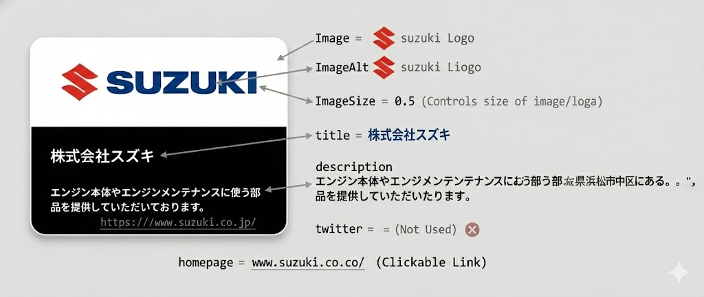

## プレビューの表示方法
```
npm run dev
```
をターミナルで実行してください。

## 注意点
github codespaceは数か月で消えます。  
必ずファイルを編集した後は、コミットをしましょう。  
コミット方法が分からない場合はAIにコマンドを実行してもらってください。  